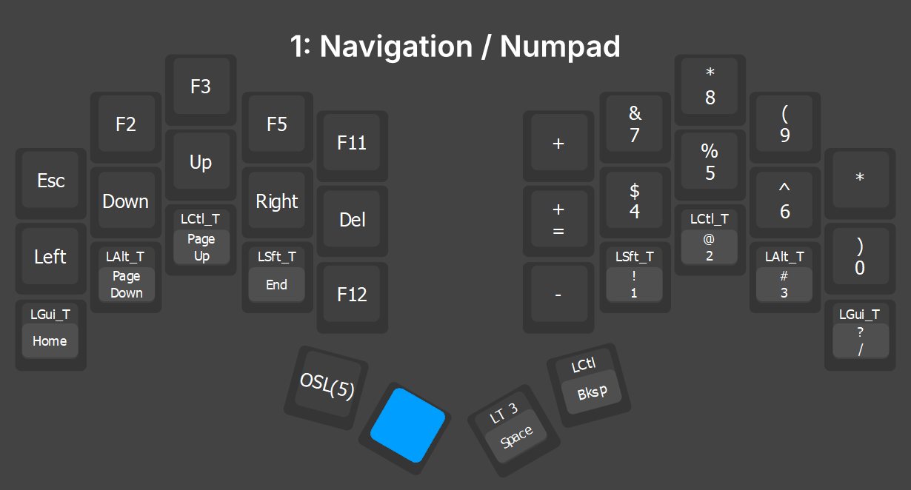
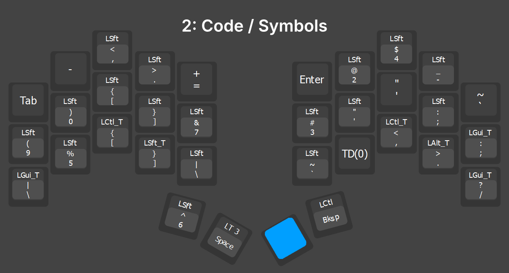
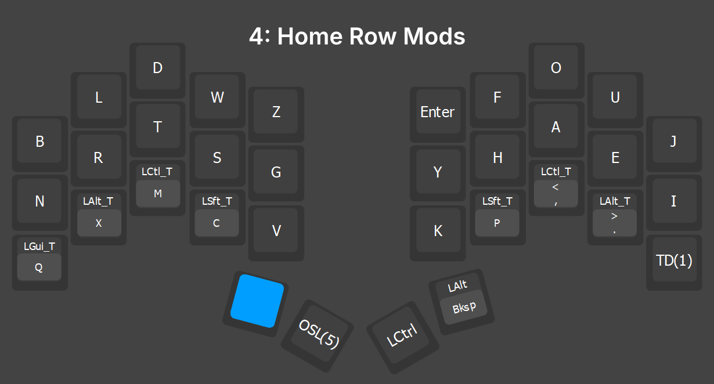
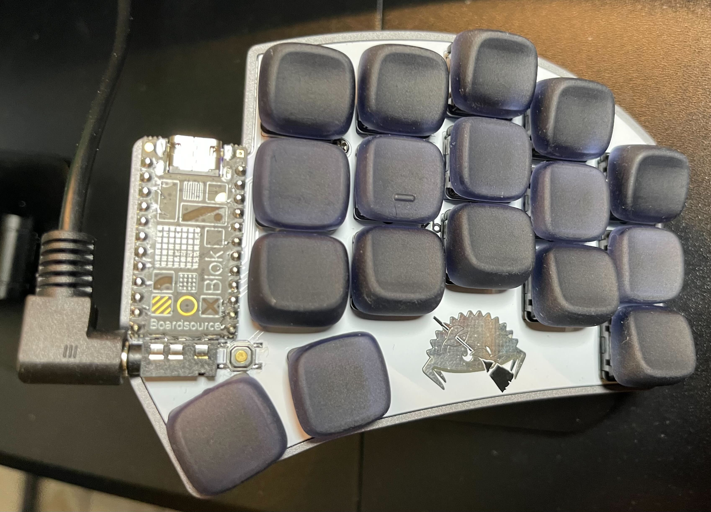

# Graphite Code Thumb

This keymap combines the following features to optimize for coding comfort. 
1. Graphite alpha-key layout
2. Mostly using one thumb key per side
3. Home row mods on a different layer
4. Capital characters on a different layer

## 0: Graphite Lower


I use the [Graphite keyboard layout](https://github.com/rdavison/graphite-layout). I originally used Colemak DH, which was a massive improvement over QWERTY, but still had some awkward combinations. Graphite has a more balanced hand and finger usage than Colemak and it feels like it has some nice rolls in it too.

After two years of optimizing my keymap I realized that the last area of discomfort was my thumbs. It turns out that moving your thumb inwards under your index finger is not comfortable. My goal was to make it so my thumbs would need minimal lateral movement. If you are experiencing any pain in your thumbs with split keyboards, I guarantee that this mapping is the solution.

The **Backspace** and **Space** keys are triggered when tapping the inner thumb keys. Holding the same keys will activate the **LT 1** and **LT 2** keys to change layers to [Navigation](#1-navigation--numpad) or [Code](#2-code--symbols). My [Vial Settings](#firmware) make it so this tap/hold functionality works 100% of the time even when toggling layers at high speeds. 

Having **Enter** at the top feels comfortable and makes it so I need one less thumb key.

**MO(4)** activates the [Home Row Mods layer](#4-home-row-mods) while held.

## 1: Navigation / Numpad



When using a split keyboard, it is important that all of the navigation keys are on the side opposite the mouse. This allows me to click code with my right hand and navigate it with my left at the same time. 

I also put **Enter** on the left half for rare cases when I need to press it while my right hand is on the mouse.

Holding the **LT 3** thumb key on the right (at this point I am still holding the left layer key) will toggle the [Uppercase layer](#3-graphite-upper).

This layer also includes Home Row Mods on the right half to use mainly with the arrow keys but also for common combos like **Ctrl +** and **Ctrl -**.

## 2: Code / Symbols



The 8 symbols on the home row locations are my most used coding symbols.

QMK does not allow you to use the Mod Tap functionality on Shifted keys, but I was able to implement the Home Row Mods using Tap Dance keys.

**TD(0)** is defined in Vial as **"** on tap and **Shift** on Hold. **TD(1)** is defined as **:** on tap and **Alt** on hold. 

This results in the home row being **<pre>( ) { } &      # " ' : ;</pre>**

Having the **=** and **-** keys also on this layer is must for coding and it feels way better on the left side in this case. It lets me type common bigrams like **->**, **>=**, and **<=** quickly.

Holding the **LT 3** thumb key on the left (at this point I am still holding the right layer key) will toggle the Uppercase layer. I can let go of both thumb keys and type a single uppercase letter or hold both to continue typing in uppercase.


## 3: Graphite Upper


Keeping the uppercase letters on a separate layer activated by the thumbs allows me to touch type as normal since I don't have to worry about holding a different **Shift** combo other than the two thumb keys I am already using. I put the **Backspace** here since it became an issue not having it while typing constants in all caps. You pretty much never hit Enter when typing in all caps too.

## 4: Home Row Mods



[Home Row Mods](https://precondition.github.io/home-row-mods) put your Shift, Ctrl, Alt, and Windows/CMD key on the 8 keys your fingers rest on when touch typing. Tapping the key triggers the normal letter, but holding it activates the modifier. This is amazing for keyboards of any size but it also introduces issues like misfires when rolling keys and adding a slight delay to the keys they are on. These issues drove me insane and so the perfect solution was to just put them on a separate layer that was easily accessible.

I also put Ctrl on the thumb for more comfort when hitting Ctrl-U and Ctrl-D a lot for half-page up/down in nvim. Alt + Backspace on the thumb is nice for doing a color fill in Affinity Photo 2 or Photoshop. I made the [Misc layer](#5-misc) a one shot so you can take a screenshot or do whatever and then be back at layer 0.

## 5: Misc


I use this layer for print screen and F6 mostly. I can press the TO(5) button on the right thumb to keep this layer locked in for WASD movement in game engines. 

## Firmware

If you own a wired keyboard, then [Vial](https://get.vial.today/) is a must-have. I wasted so much time tweaking the QMK firmware myself and then using VIA. Vial is a fork of the [QMK Firmware](https://github.com/qmk/qmk_firmware) that allows you to configure a lot of the QMK settings from within a GUI instantly and you don't need to manually type key codes like in VIA.

Here are my QMK settings with Tapping Force Hold being a must to get the thumb layer switching working 100%:


- [Download my Vial saved layout](ferris-sweep-vial.vil) - Requires downloading the Vial app

### Compiling Vial

If you do not see the QMK Settings tab in Vial or if your keyboard doesn't support Vial by default, you will need to recompile the firmware. 

Download the [Vial GitHub repository](https://github.com/vial-kb/vial-qmk) and then follow [This Guide](https://docs.qmk.fm/newbs_getting_started).

Add this flag in your keyboard's rules.mk file:

```
QMK_SETTINGS = yes
```

My command to compile in QMK MSYS:
```
qmk compile -kb ferris/sweep -km vial -e CONVERT_TO=blok
```

## Hardware

[](images/hardware1.jpg)

[](images/hardware2.jpg)
[](images/hardware3.jpg)


- [Crab Broom (Choc Ferris Sweep)](https://www.boardsource.xyz/products/crab-broom)

- [Ambient Silent Nocturnal Switches](https://lowprokb.ca/products/ambients-silent-choc-switches?variant=44873446391972) - These are 20G Linear switches that feel amazing and are ultra silent. I used Purpz (25G Linear) and Pinks (20G Linear) before this.

- [Choc v1 Lame Keycaps](https://3dkeycap.com/products/klp-choc-keycap-set-low-profile-ergonomic-sculpted-keycaps?variant=43956927136002) - These things are perfection. They feel smooth to the touch but my fingers don't slide like with MBK keycaps. They took about 8 days to ship out plus another 10 in the US mail, but worth the wait.

- [Chosfox Keycaps](https://www.amazon.com/dp/B0CP28G897) - My old keycaps that felt great.

- [UGREEN MagSafe Stand](https://www.amazon.com/dp/B0CMHT5LZ5) - Comes with MagSafe sticker to attach to the back of your keyboard. Extremely strong, I use this for my iPad with no worries or movement. I tent everything at 45 degrees (Use the Measure app on your phone to level this).

- [90 degree TRRS Cable](https://www.amazon.com/dp/B0C7P6VHZM)

- [Apple Magic Trackpad](https://www.amazon.com/dp/B0DL6L6HPG) - I have tried every conceivable type of "mouse" and this is the only thing that doesn't hurt after long-term use. Tented at 40 degrees.

- [VIVO Keyboard Tray](https://www.amazon.com/dp/B07HFDJCSL) - Having your arms and legs bent at 90 degrees is crucial for ergonomics. The only way most of us can do this is with a keyboard tray. Once you introduce tenting, it makes a tray more necessary.

- [Koolertron 23 Key Keyboard](https://www.amazon.com/dp/B07RM1TBR8) - This is what I actually use for gaming. It comes with linear red switches and even came with an extra set of high quality white PBT keycaps. The best part is that it has full QMK layer support in VIAL!

## Resources

- [Vial](https://get.vial.today/)
<br><br>

- [Must-watch video on tenting](https://www.youtube.com/watch?v=pUKoB95aEc4)

- [What makes a keyboard layout good?](https://semilin.github.io/blog/2023/layout_quality.html)

- [Keyboard layout family tree](https://www.reddit.com/r/KeyboardLayouts/comments/11g3xlx/keyboard_layout_family_tree/)

- [Oxey's Layouts](https://oxey.dev/index.html)
<br><br>

- [KeyBR](https://www.keybr.com/) - The best site for learning a new layout

- [MonkeyType](https://monkeytype.com/) - work into "english 10k" with punctuation and numbers as fast as possible. Best coding languages to practice in are "code python 5k", "code r 2k", and "code zig". They offer the largest vocabulary and symbol sets. It doesn't matter if you actually code in these languages. Turn off smooth caret. Always train accuracy over speed.

- [SpeedTyper.dev](https://speedtyper.dev/)

## Vim Motions in VSCode

After learning Colemak and Graphite, I knew that my code navigation skills needed to be optimized. Even if you learn every hotkey in VSCode, there is only so much it can do. To unlock true optimization you need to use [Vim Motions](https://www.youtube.com/watch?v=lWTzqPfy1gE). I just use the arrow keys on Layer 1 to move around instead of **H, J, K, L**. 
- [CVim extension for Visual Studio Code](https://marketplace.visualstudio.com/items?itemName=cuixiaorui.cvim&ssr=false#overview) - Supports the flash.nvim plugin of nvim. This is a game changer. 

- [Info page for CVim extension](https://github.com/VSCodeVim/Vim/issues/8567) - Check out everything this extension can do.

Add this to your VS Code settings.json (Ctrl+Shift+P then Open User Settings(JSON)):
```
"vim.flash.enable": true,
"vim.useSystemClipboard": true,
"vim.handleKeys": {
	"<C-w>": false,
	"<C-b>": false,
	"<C-f>": false,
	"<C-p>": false,
},
"vim.normalModeKeyBindingsNonRecursive": [ 
    // default vim undo/redo is horrible, so just use VSCode's
     { 
         "before": ["u"], 
         "after": [],
         "commands": [
             {
                 "command": "undo", 
                 "args": []
             }
         ] 
     },
     { 
         "before": ["<C-r>"], 
         "after": [],
         "commands": [
             {
                 "command": "redo", 
                 "args": []
             }
         ] 
     },  
 ],
"vim.visualModeKeyBindingsNonRecursive": [
    // default vim paste clears the clipboard, so just flip the behavior
    {
        "before": ["p"],
        "after": ["P"]
    },
    {
        "before": ["P"],
        "after": ["p"]
    }
  ],
  "editor.lineNumbers": "relative",
```
